# Full Stack Smart HR Resume Screener System

## CV Management Service
A FastAPI-based microservice for managing CVs, categories, and candidate search using hybrid retrieval (FAISS + BM25). This system provides intelligent candidate matching, automated profile extraction, and recruitment email generation.

## Features
- **Category Management**: Create and manage different job categories
- **CV Processing**: Extract text from PDFs and generate structured candidate profiles
- **Hybrid Search**: FAISS semantic search + BM25 keyword search with optional LLM reranking
- **Email Automation**: Generate and send professional recruitment emails
- **Real-time Indexing**: Automatic vector store updates on new uploads

## Installation

### Prerequisites
- Python 3.8+
- Conda (recommended) or virtualenv
- Git

### Setup Instructions
1. Clone the repository
```bash
git clone <your-repository-url>
cd HR-Resume-Screener
```
2. Create and activate Conda environment
```bash
conda create -n smart_hr python=3.9
conda activate smart_hr
```
3. Install dependencies
```bash
pip install -r requirements.txt
```
4. Set up environment variables
Create a `.env` file in the root directory with the following variables:
```ini
HF_TOKEN=your_hugging_face_token
HR_SMTP_GMAIL=your_gmail_app_password
OPENROUTER_API_KEY=your_openrouter_api_key
EMAIL_FROM=your_email@gmail.com
EMBEDDING_MODEL=all-MiniLM-L6-v2
LLM_MODEL=openai/gpt-oss-120b
OPENROUTER_BASE_URL=https://openrouter.ai/api/v1
```
5. Create data directory structure
```bash
mkdir -p data/categories
```

## Running the Application
Start the FastAPI server:
```bash
uvicorn app.main:app --reload --host 0.0.0.0 --port 8000
```
The API will be available at: `http://localhost:8000`

Access the interactive API documentation at: `http://localhost:8000/docs`

## API Endpoints

### Categories
- `GET /categories` - List all categories
- `POST /categories` - Create a new category

### CV Management
- `POST /cvs/upload` - Upload and process a CV
- `GET /cvs?category=X` - List all CVs in a category
- `GET /cvs/{cv_id}/preview` - Preview a CV file
- `DELETE /cvs/{cv_id}` - Delete a CV

### Search
- `POST /search` - Search candidates using hybrid retrieval

### Email
- `POST /emails/generate` - Generate recruitment email
- `POST /emails/send` - Send recruitment email

## Usage Examples

### Upload a CV
```bash
curl -X 'POST' \
  'http://localhost:8000/cvs/upload' \
  -H 'accept: application/json' \
  -H 'Content-Type: multipart/form-data' \
  -F 'file=@cv.pdf;type=application/pdf' \
  -F 'category=Engineering'
```

### Search for Candidates
```bash
curl -X 'POST' \
  'http://localhost:8000/search/' \
  -H 'accept: application/json' \
  -H 'Content-Type: application/json' \
  -d '{
    "job_description": "Looking for a Python developer with ML experience...",
    "category": "Engineering",
    "top_n": 5,
    "rerank": true
  }'
```

## Project Structure
```
HR-Resume-Screener/
├── app/
│   ├── main.py               # FastAPI application
│   ├── core/
│   │   ├── config.py        # Application configuration
│   │   └── logger.py        # Security utilities
│   ├── models/
│   │   └── schemas.py       # API schemas
│   ├── services/
│   │   ├── cv_service.py    # CV processing service
│   │   ├── category_service.py # Category management
│   │   ├── search_service.py  # Search functionality
│   │   ├── email_service.py   # Email services
│   │   └── vector_store.py   # Vector store management
│   ├── routers/
│   │   ├── categories.py    # Category endpoints
│   │   ├── cvs.py           # CV endpoints
│   │   ├── search.py        # Search endpoints
│   │   └── emails.py        # Email endpoints
│   └── utils/
│       ├── pdf_parser.py    # PDF text extraction
│       ├── profile_generator.py # Candidate profile generation
│       ├── email_generator.py  # Email generation
│       ├── reranker.py       # LLM reranking
│       └── file_utils.py     # File utilities
├── data/
│   └── categories/           # Category data storage
├── requirements.txt          # Python dependencies
└── .env                     # Environment variables
```

## Key Technologies
- **FastAPI**: Modern, fast web framework for building APIs
- **FAISS**: Facebook AI Similarity Search for vector similarity
- **BM25**: Best Matching 25 algorithm for keyword search
- **SentenceTransformers**: Text embeddings generation
- **PyMuPDF**: PDF text extraction
- **LangChain**: LLM integration and prompt engineering
- **OpenAI API**: Advanced language model capabilities

## Troubleshooting

### Common Issues
- **Import errors**: Make sure all dependencies are installed correctly
- **Environment variables**: Verify all required variables are set in `.env`
- **File permissions**: Ensure the application has write access to the `data` directory
- **API keys**: Validate that all external service keys are correct

### Getting Help
Check the logs for detailed error messages when encountering issues. The application provides comprehensive logging to help diagnose problems.

## Screenshots

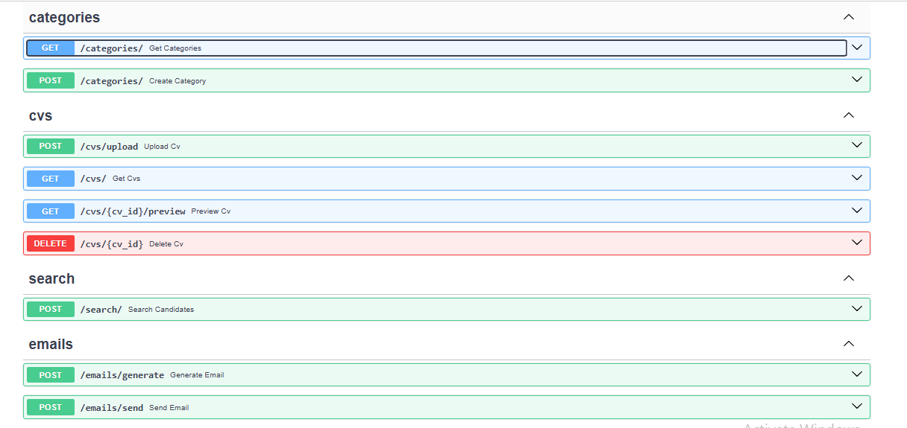
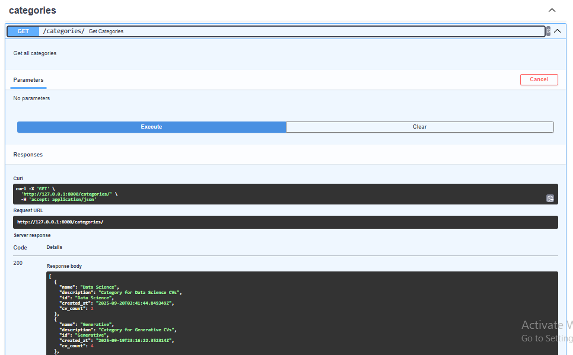
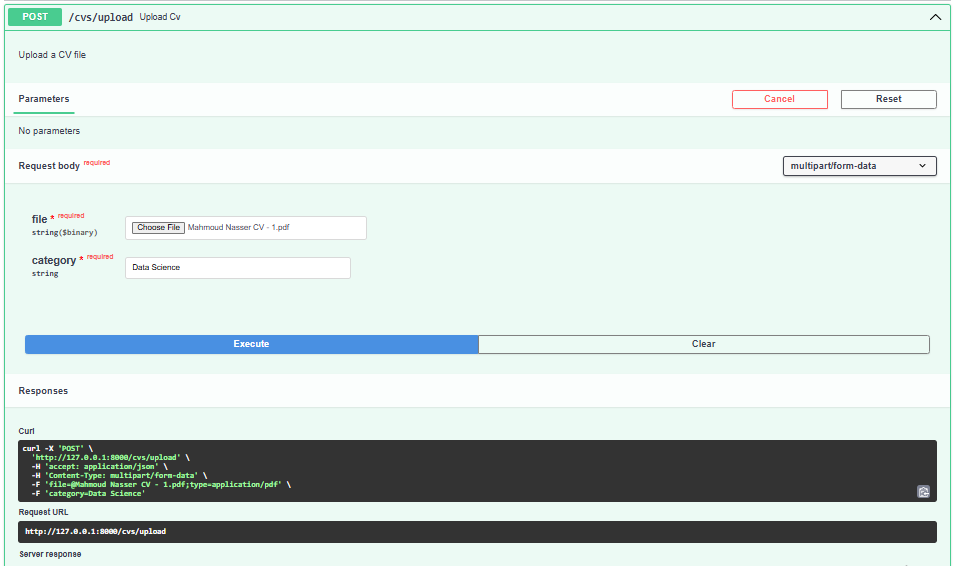
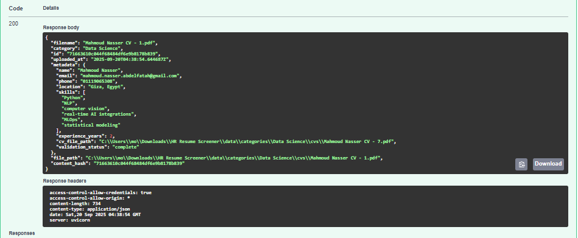
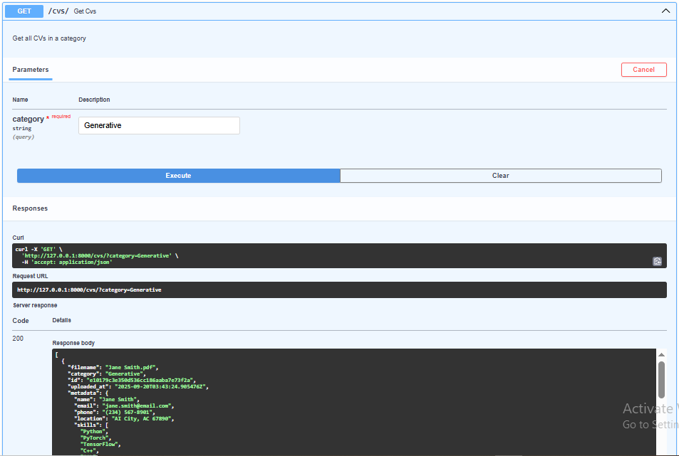
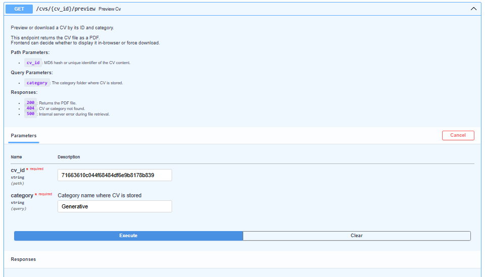
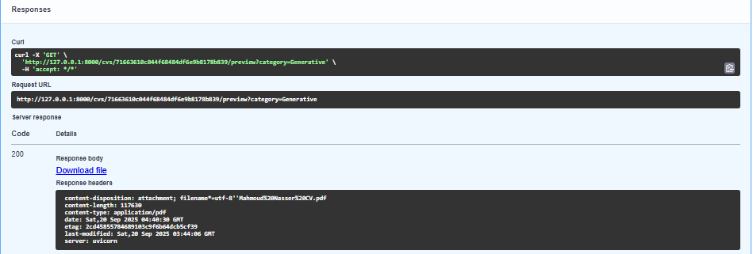
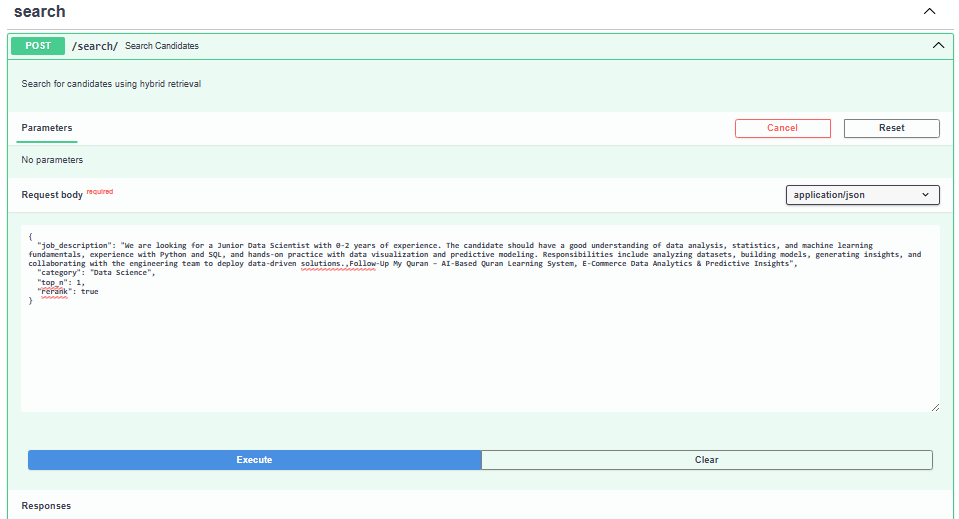
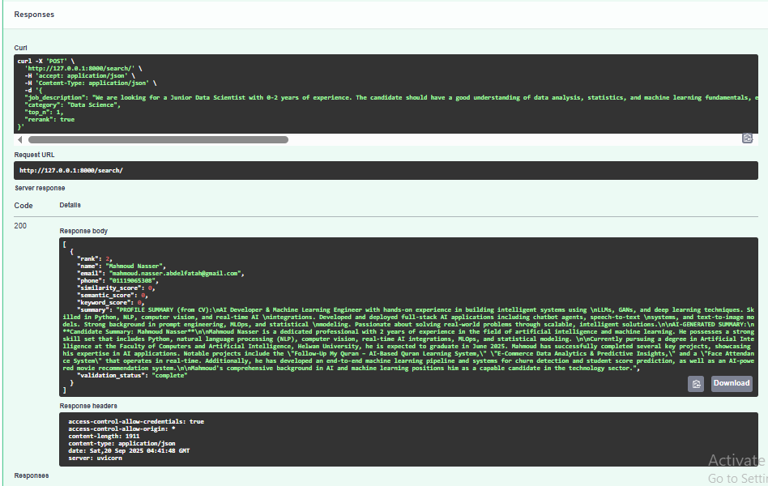
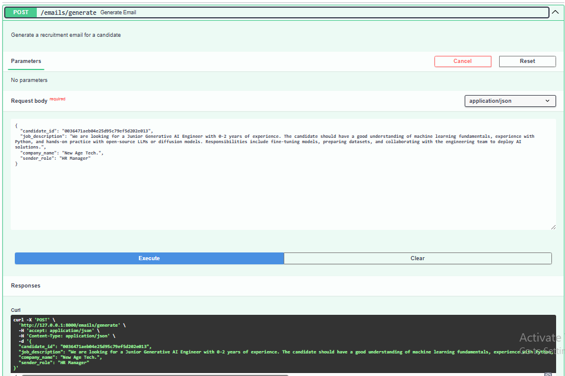
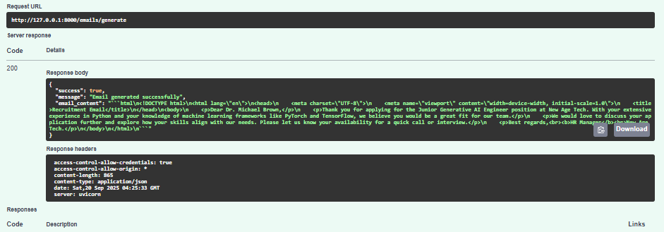
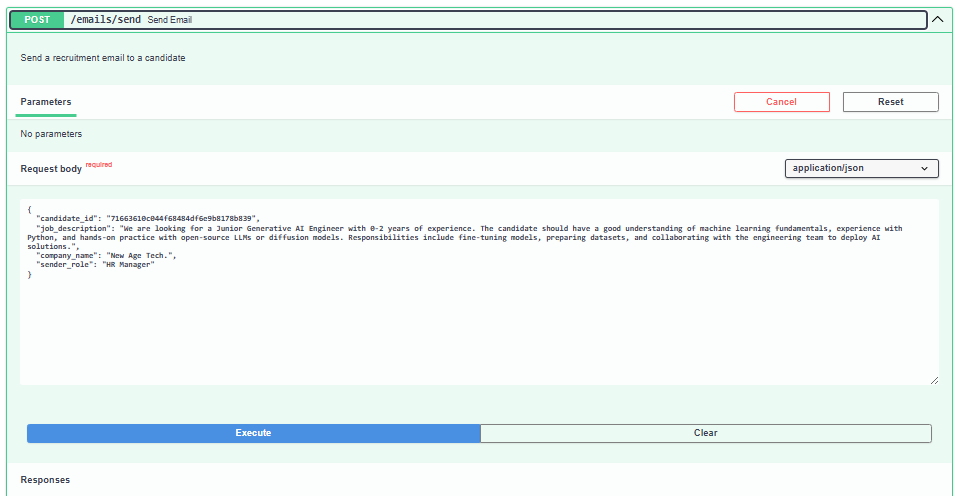
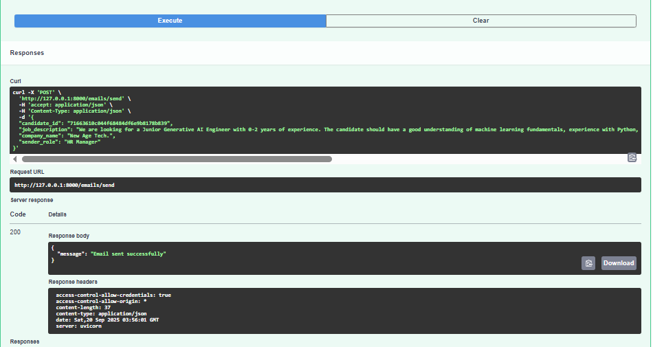

## License
This project is proprietary software. All rights reserved.

## Contributing
For contribution guidelines, please contact the project maintainers.